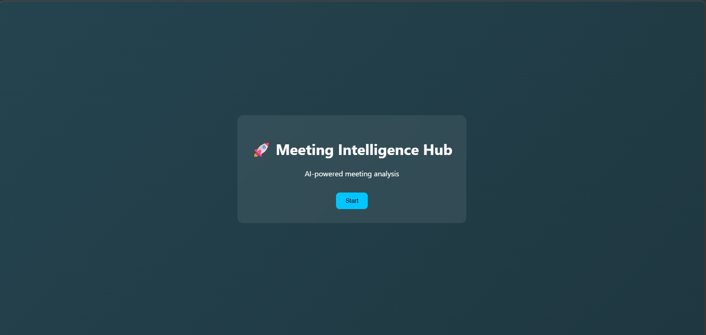
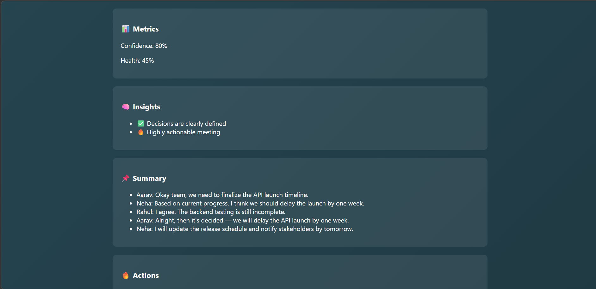
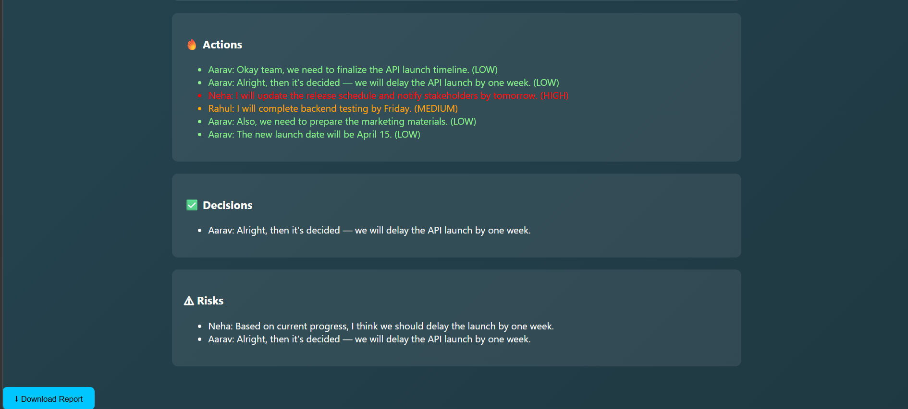

# Meeting Intelligence Hub

### *Turning conversations into decisions.*

---
## Approach

The system is designed to process meeting data and extract structured information in an automated manner.

1. Input Collection  
   Meeting audio or text data is captured and converted into a usable format.

2. Preprocessing  
   The input is cleaned and segmented to remove noise and improve accuracy.

3. Information Extraction  
   Natural Language Processing techniques are used to identify key elements such as:
   - Important discussion points  
   - Action items  
   - Key decisions  

4. Task Classification  
   Extracted action items are analyzed and automatically categorized based on priority levels (e.g., High, Medium, Low).

5. Structuring Output  
   The processed information is organized into a clear and readable format, including summaries and task lists.

6. Output Generation  
   The final output is presented to the user in an accessible format for quick understanding and follow-up.

This approach ensures efficient conversion of unstructured meeting data into meaningful and actionable insights.

##  Demo


Note:The application is demonstrated locally. Deployment was attempted but not included due to runtime constraints. 
---

## 🔴 The Problem

Modern organizations conduct frequent meetings that generate long transcripts. Important information such as decisions, action items, and risks often gets buried in these transcripts, forcing teams to revisit discussions instead of executing tasks efficiently.

---

## 🟢 The Solution

Meeting Intelligence Hub transforms raw meeting transcripts into structured insights. It automatically extracts summaries, action items, decisions, and risks, helping teams quickly understand outcomes and take action without re-reading entire transcripts.

---
## Features

- Upload meeting transcripts (.txt)
- AI-powered analysis of conversations
- Automatic extraction of:
  - Summary
  - Action Items
  - Key Decisions
  - Risks
- Fast and simple UI for instant insights
- Secure API key handling using environment variables

## How It Works

1. User uploads a meeting transcript via frontend  
2. File is sent to FastAPI backend  
3. Backend processes text and extracts insights  
4. OpenAI API (optional) enhances analysis  
5. Results are returned and displayed in UI

## Tech Stack

- **Frontend:** HTML, CSS, JavaScript  
- **Backend:** FastAPI (Python)  
- **AI:** OpenAI API  
- **Libraries:** python-dotenv, python-multipart, requests  
- **Tools:** Git, GitHub, VS Code

---

## Setup Instructions

### 1. Clone the repository

```bash
git clone https://github.com/aryagithubrit/meeting-intelligence-hub.git
cd meeting-intelligence-hub
```

### 2. Create virtual environment

```bash
python -m venv venv
venv\Scripts\activate
```

### 3. Install dependencies

```bash
pip install -r requirements.txt
```

### 4. Add API key

Create a `.env` file:

```env
OPENAI_API_KEY=your_api_key_here
```

### 5. Run backend

```bash
uvicorn backend.app:app --reload --port 8006
```

### 6. Run frontend

Open:

```
frontend/index.html
```


## Screenshots

### 🔹 Welcome Page


### 🔹 Upload Page


### 🔹 Analysis Page


### 🔹 Analysis cont


---

## Challenges I Faced 

This project wasn’t straightforward at all:

*  GitHub blocked my push because of exposed API key
  → learned how to properly secure secrets

*  Frontend couldn't talk to backend
  → fixed using middleware

*  FastAPI import issues (`ModuleNotFoundError`)
  → restructured project properly

*  Infinite loading bug in frontend
  → debugged using browser console

---

##  Security

API keys are **not stored in the code**.

They are handled using:

* `.env` file
* environment variables

---

##  Future Scope

* Real-time meeting transcription
* Meeting analytics dashboard
* Team collaboration features
* Deployment as SaaS

---

## About Me

Hi, I'm Arya, a BTech undergraduate in Electronics and Communication Engineering.  
This project helped me explore full-stack development and AI integration, while also improving my problem-solving and debugging skills through real-world challenges.

---

