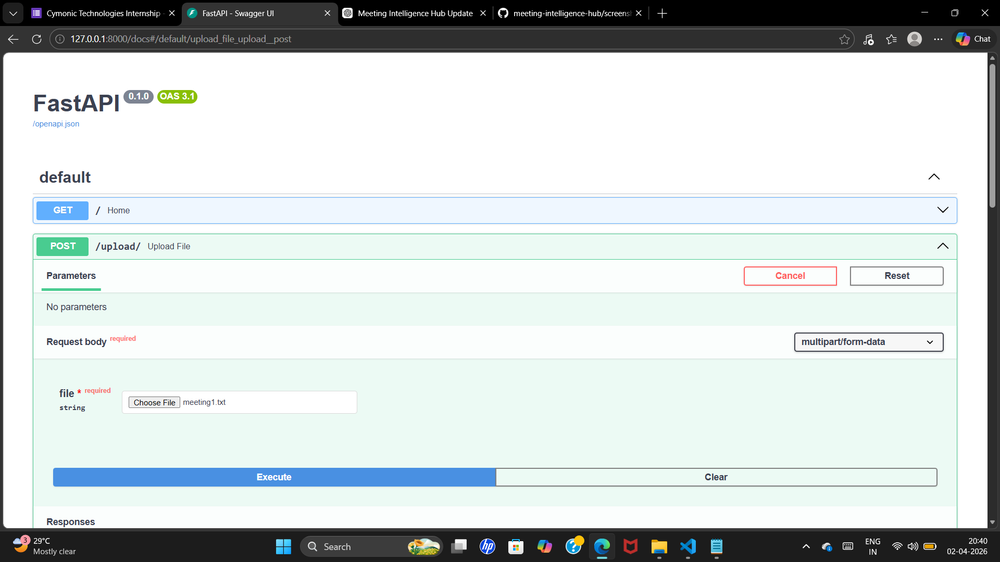
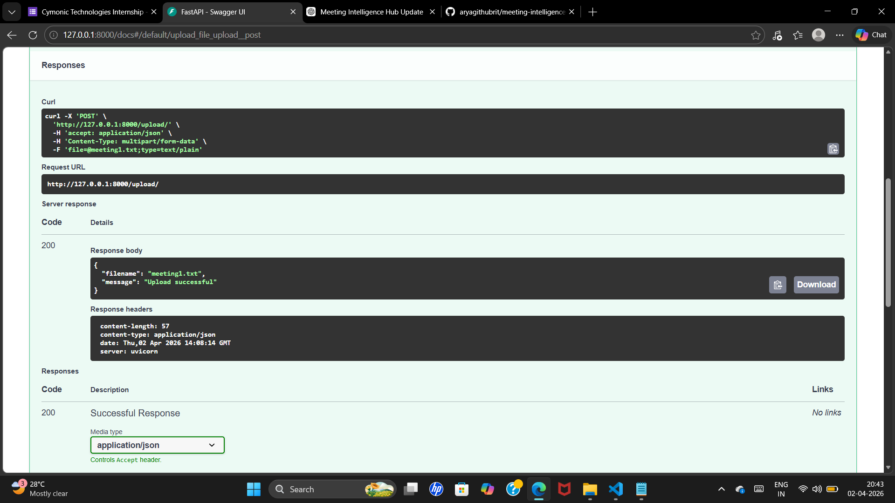

# Meeting Intelligence Hub

AI-powered system to extract decisions and action items from meeting transcripts.

---

## 🚀 Features

- Upload meeting transcripts
- Backend built using FastAPI
- Structured project architecture.
- Ready for AI-based analysis

---

## 📸 Project Preview

  
  

## 🛠 Tech Stack

- Python
- FastAPI
- Git & GitHub

---

## 📂 Project Structure

backend/ → API and logic  
data/ → transcript storage  

---

## 🔗 GitHub Repository

https://github.com/aryagithubrit/meeting-intelligence-hub
